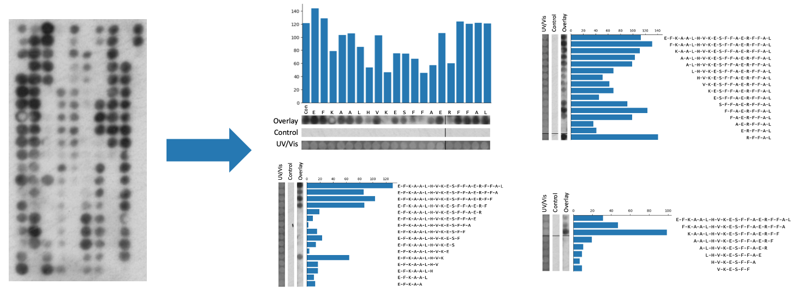

# Summary

The Pep Genie is a Django based website application that simplifies and speeds up the data analysis of peptide arrays. 

Peptide array screening is a method for analysing peptide binding against target proteins. Peptides arrays are small peptide libraries synthesised as a grid of spots on a membrane. Binding of an overlaid target is determined by immunodetection, and results in a grid of binding spot signals. 

Peptide arrays are analysed by measuring spot intensity and slicing spot images (Figure 1). 
Done manually, this is a lengthy and painstaking process. 
The Pep Genie provides a grid drawing method for the quick measurement of peptide array binding spots and slicing of spot images, and prepares the data directly in PowerPoint presentation format, saving considerable of time and work. 
The Pep Genie is an open-source software that is freely available at the host website and the GitHub repository.

[The Pep Genie](http://pepgenie.pythonanywhere.com)
<http://pepgenie.pythonanywhere.com>

[GitHub thomas-wright-bioinformatics](https://github.com/thomas-wright-bioinformatics)
<https://github.com/thomas-wright-bioinformatics>

