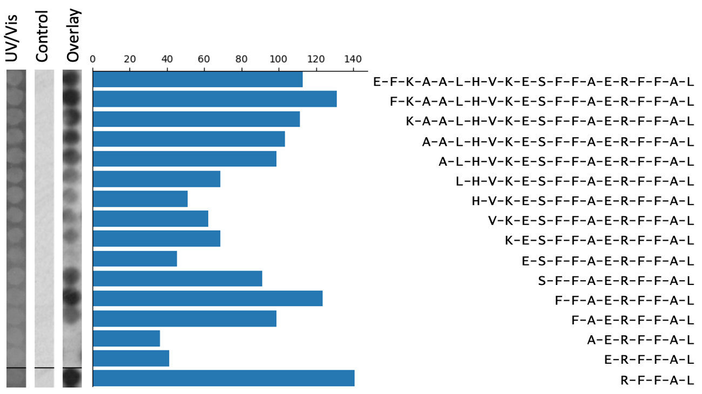

# Summary

The Pep Genie is a Django based website application that simplifies and speeds up the data analysis of peptide arrays. 

Peptide array screening is a method for analysing peptide binding against target proteins. Peptides arrays are small peptide libraries synthesised as a grid of spots on a membrane. Binding of an overlaid target is determined by immunodetection, and results in a grid of binding spot signals. 

Peptide arrays are analysed by measuring spot intensity and slicing spot images (Figure 1). 
Done manually, this is a lengthy and painstaking process. 
The Pep Genie provides a grid drawing method for the quick measurement of peptide array binding spots and slicing of spot images, and prepares the data directly in PowerPoint presentation format, saving considerable of time and work. 
The Pep Genie is an open-source software that is freely available at the host website and the GitHub repository.

[The Pep Genie](http://pepgenie.pythonanywhere.com)
<http://pepgenie.pythonanywhere.com>

[GitHub thomas-wright-bioinformatics](https://github.com/thomas-wright-bioinformatics)
<https://github.com/thomas-wright-bioinformatics>

# Statement of need

Peptide array analysis involves three main challenges.

**1. Labour intensive densitometry measurement of tens to hundreds of binding spots**

A typical peptide array experiment involves the analysis of 20-800 peptide binding spots. There is a lack of tools that allow for simple and rapid intensity measurement. Current options include the open-source software ImageJ/FIJI or Licor’s ImageStudio Lite. 

A researcher would normally rely on freely available image analysis software such as the open-source software ImageJ/FIJI or Licor’s ImageStudio Lite. Measurement would entail drawing selection circles manually over each individual spot in the image. For large arrays consisting of hundreds of spots, this would be tedious and time-consuming. One tool, ImageStudio (full version), allows a researcher to draw a grid of spots without having to individually draw each spot. This is a considerable improvement, but the data is arranged in a difficult layout, and the software is available only by special request from Licor for groups who own a Licor Instrument. This is a restrictive requirement. The Pep Genie provides a grid drawing tool and automated analysis, allowing a researcher to quickly measure peptide spots. 

### 2. Arrangement of binding spot ‘strips’ into a presentable figure

Perhaps the most time-consuming step in peptide array analysis is the preparation of the strips of spots for the final figure. In peptide array data, figures always include binding images of the columns of peptide spots (figure 2). This is analogous to the images of bands on a western blot figure. Three images are usually included: the test array, the control array, and the UV/Vis control array. These are positioned next to text labels that indicate their amino acid sequence. A bar graph may be included showing the intensity measurements of the spots. In standard peptide array experiments, there are usually three to ten of these figures, one for each peptide series of interest. For example, these can be an alanine scan and N,C-terminal truncations. To make these image slices/strips, a researcher would have to identify the correct spots from the grid of binding spots, and then screenshot the series of spots into a PowerPoint file. The strips must be of uniform thickness and perfectly aligned with each other. To add further to the challenge, a series of peptide spots can span more than one column on the peptide array. This means that a researcher must join together two screenshots of the spots, meanwhile making sure to maintain an even image width and proper alignment. Repeated 30 times, this makes for an arduous process. Quite often, these figures must be generated before it can be seen if the experiment was a technical success. If the experiment did not work, this work would have to be repeated. As part of the grid drawing tool of the Pep Genie, not only are the spots quickly measured, but images of the spots are automatically generated and joined together where needed. This automation saves considerable time. 

{height="9pt"}

### 3. Control spots can be too faint to align into a figure

In peptide array experiments, a blank image for the control array is desired, as this indicates a lack of non-specific binding. However, this makes it very difficult to make spot strip images and align them with the test and UV/Vis control images. If using the screenshotting method to capture the rows of spots or drawing circles to measure spots, it would be very hard to find them from a near-blank screen. As part of the grid drawing step in the Pep Genie, the grid for outlining the control array is automatically sized according to the previously aligned test array. With the width and height of the grid preset for the user, it is much easier to align the grid to the control spots. 

